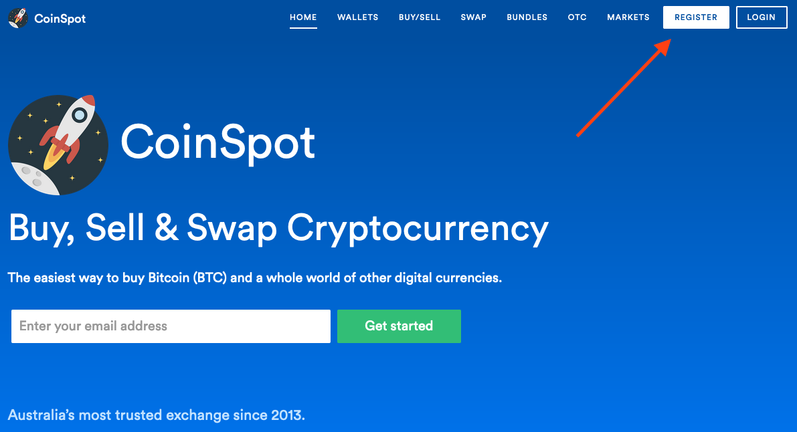
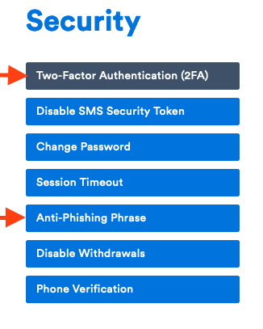
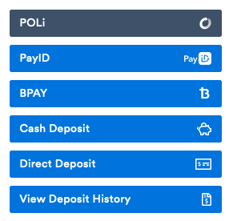

# Coinspot


**Disclaimer**: Coinspot does not endorse or in any other way sponsor this content.


## Create an account

Navigate to [https://www.coinspot.com.au/](https://www.coinspot.com.au/) and click register:

## Secure your account

From the top menu, select the Account drop down and choose **Security**:

From here, setup 2FA and an anti-phishing phrase:

Familiarise yourself with these settings and their meaning. **Your exchange account is now more secure!** Time to fund it!


Take your time to understand the **interface and settings** of your exchange.


## Fund your account

Now that you have secured your account, it's time to transfer some of your hard-earned dollars to it. Navigate to the **Deposit Funds** button \(top left\), the page that follows will have a number of options for funding your account:


Each method will have its own fees and daily limits: choose the one that best suits you.


