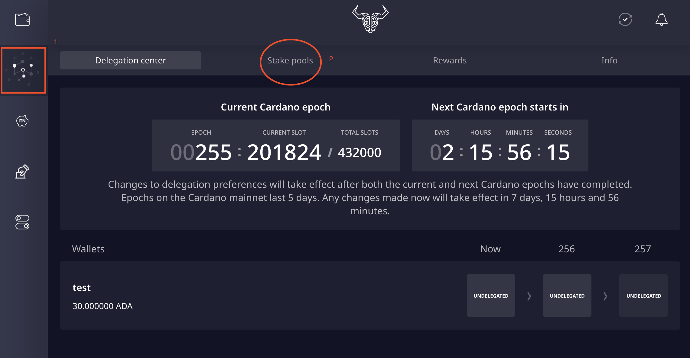
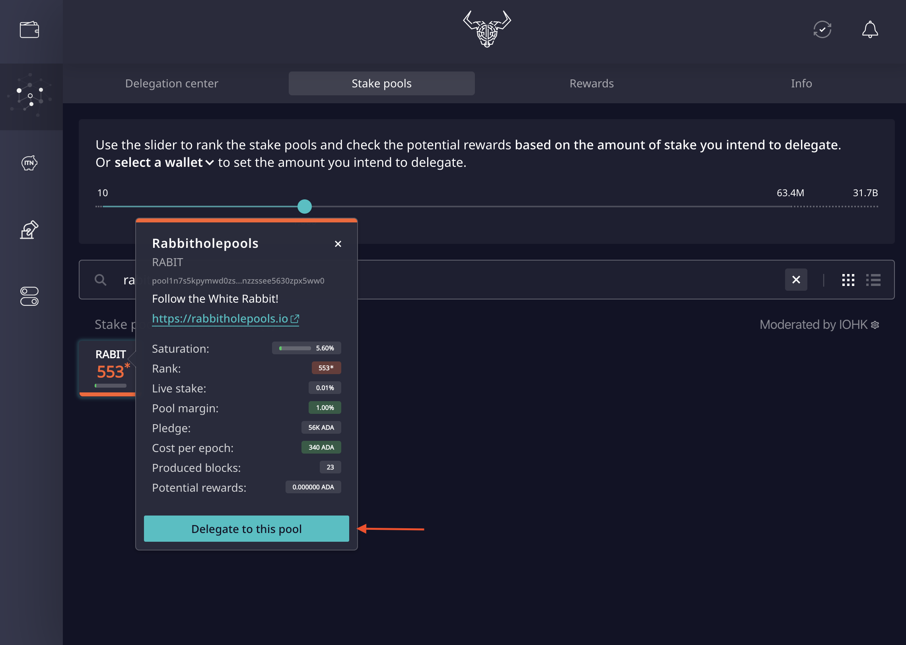
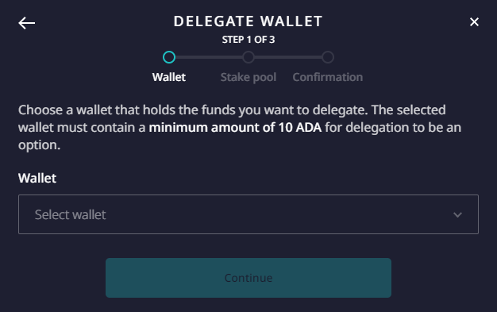
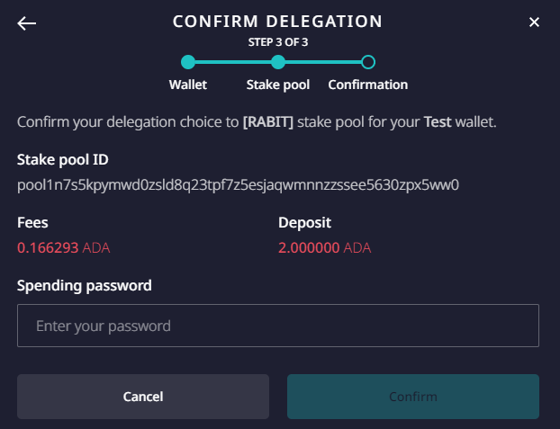
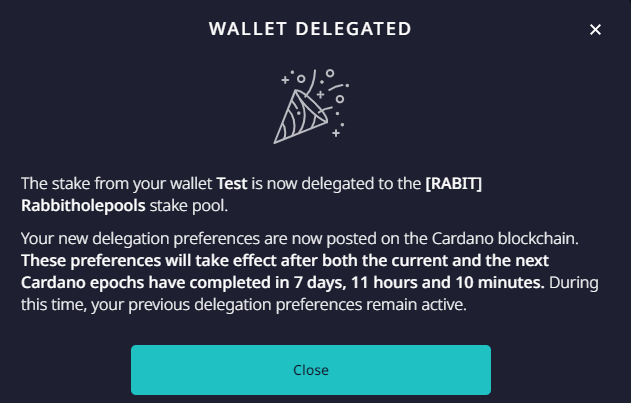

# 5. Delegating your ADA


When you delegate your funds, these remain in your **full control**. Cardano also has **no lock-in** period.

Your first delegation will incur a \(refundable\) **delegation fee**. Should you delegate your funds to a different pool, your operation will only incur a **small transaction fee** \(non refundable\). 


## Delegating from Daedalus

Navigate to \(1\) the Delegation Centre and choose \(2\) Stake Pools:

Search for the pool you wish to delegate to and select "**Delegate to this pool**":

In the following dialogue, **select the wallet** to delegate from:

You will now be prompted to enter your **spending password** to confirm delegation preferences:


It is recommended to **change your spending password every time you use it**.


Once **delegation is successful** you should see this dialogue box:

## Delegating from Yoroi

WIP

## Congratulations!

Your ADA is now delegated to a stake pool 👏 : your are **actively securing Cardano**, while **earning ADA rewards**!


Please note that, like your delegation preferences, **staking rewards** are paid out to you after 2 Epochs have passed since rewards were calculated.

 


