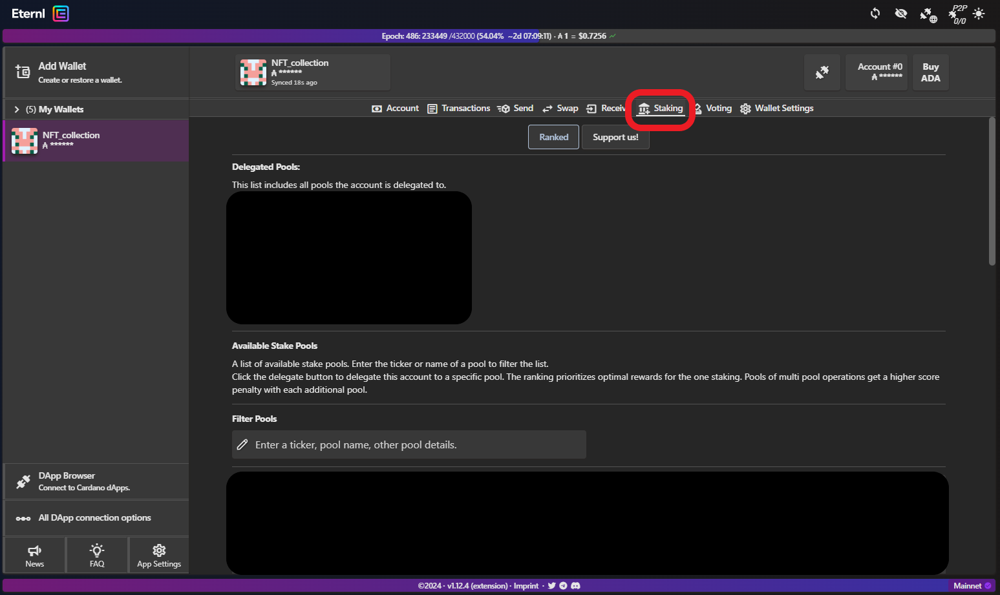
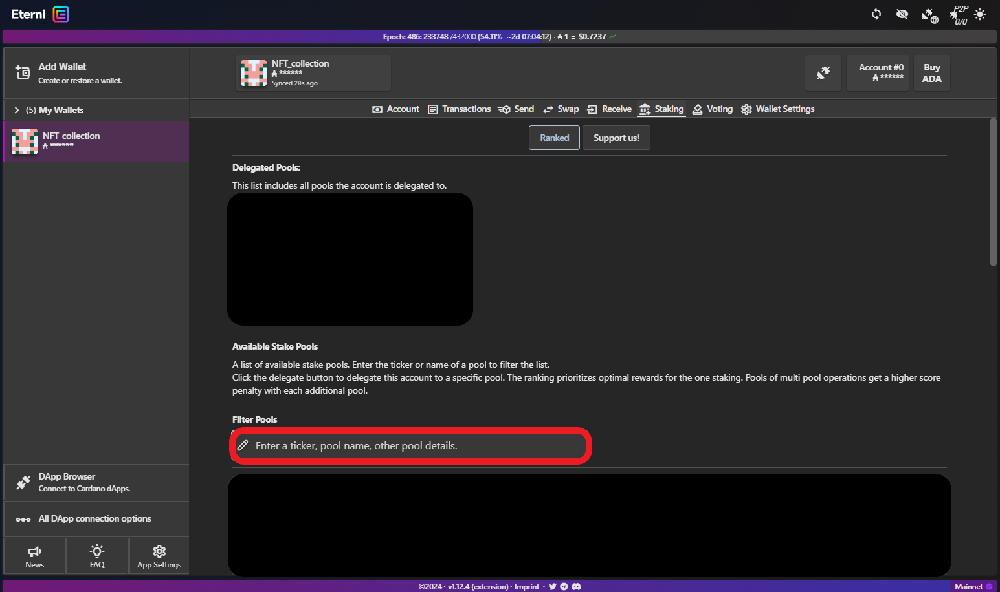
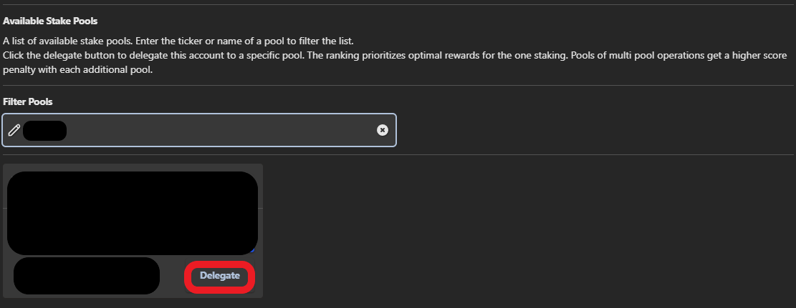
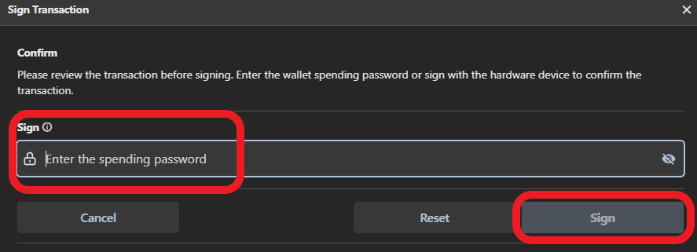

# 🤝 5. Delegating your ADA


When you delegate your funds, these remain in your **full control**. Cardano also has **no lock-in** period.


## Delegating to a Stake Pool&#x20;

Now that you've [created your wallet](choosing-a-wallet-app/) and [funded it](sending-ada-to-your-personal-wallet.md), you want to consider delegating to a Stake Pool.


Your first delegation will incur a (refundable) **delegation fee**. Should you delegate your funds to a different pool, your operation will only incur a **small transaction fee** (non refundable).


There is no valid reason not to delegate your stake to a Pool and it can be done by following the steps below. If you would like to know more about Staking on Cardano, please refer to the original post by [Prof. Aggelos Kiayias, Chief Scientist for Cardano](https://iohk.io/en/blog/posts/2020/11/13/the-general-perspective-on-staking-in-cardano/).


Some [exchanges](choosing-an-exchange.md) offer Cardano staking services. It is always best to transfer your funds off exchanges and delegate to a Stake Pool instead. Learn why [here](further-reading/exchange-vs-spo-staking.md).


## Choosing a Stake Pool

Making recommendations about individual Stake Pools is not the scope of this guide. There are some excellent tips in [Selecting a Pool for your Delegation](https://cardano-community.github.io/support-faq/select-pool-to-delegate/).


Do your own research!


You can also check out these [Stake Pool Alliances](further-reading/some-links-of-interest.md) if you wish.&#x20;


Use [Explorers](further-reading/some-links-of-interest.md) to monitor the **performance of your stake pool of choice**: if a pool does not mint any new blocks in an Epoch, neither you nor the stake pool operator will earn rewards.&#x20;


## Delegating from Daedalus

Navigate to (1) the Delegation Centre and choose (2) Stake Pools:

Search for the pool you wish to delegate to and select "**Delegate to this pool**":

In the following dialogue, **select the wallet** to delegate from:

You will now be prompted to enter your **spending password** to confirm delegation preferences:


It is recommended to **change your spending password every time you use it**.


Once **delegation is successful** you should see this dialogue box:

## Delegating from Yoroi

From the "**Delegation List**" tab, 1) **search** for your selected **stake pool** and 2) click "**DELEGATE**":&#x20;

Next**, confirm the transaction**. You will be asked to **enter your spending password**:


We recommend changing your spending password each time you use it.


Once **delegation is successful** you should see this dialogue box:

## Delegating from Eternl


The pools in the images below are intentionally deleted. Your staking page will look slightly different.&#x20;


Click on **Staking** from your Wallet's page**:**

<figure><figcaption></figcaption></figure>

Type the **name or ticker of the pool** you wish to delegate to:

<figure><figcaption>
Type the name of your pool of choice
</figcaption></figure>

 

<figure><figcaption>
Click the Delegate button
</figcaption></figure>

In the dialogue that follows, enter your **spending password** and click **Sign**:

<figure><figcaption></figcaption></figure>


Back on your wallet's main page (**Account > Summary**), you'll see the **updated balance** (after fees and deposit of the stake key) and your **pool preference**.&#x20;


## Congratulations!

Your ADA is now delegated to a stake pool :clap: : you are **actively securing Cardano**, while **earning ADA rewards**!


**Success!** Now that your wallet is delegated to a pool, you will start accruing rewards. The funds are still in your **full control**: you can spend them, transfer them, delegate them to a different pool.



All changes in Cardano take 2 epochs to take effect (delegation, reward distribution, etc). More on this topic on [Cardanians' Medium](https://cardanians-io.medium.com/cardano-staking-practical-information-3c86cbc73bd4).

