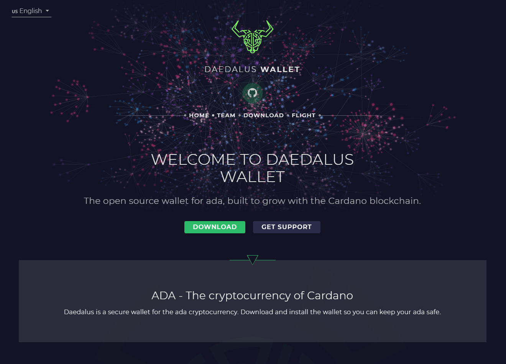

# Installing a wallet app

## Daedalus

Daedalus is a **Cardano Wallet** made by [IOG ](https://iohk.io/)\(the developing company behind Cardano\). It is a desktop application, which works with **all major Operating Systems** \(Windows, MacOS and Linux\). 

> Daedalus is a full node wallet. This means that unlike light wallets \(e.g.Yoroi, Adalite etc.\) Daedalus downloads a full copy of the Cardano blockchain and independently validates every transaction in its history. That way you get maximum security and completely trustless operation, without centrally hosted 3rd party servers.

**Daedalus** can be downloaded here: [https://daedaluswallet.io/](https://daedaluswallet.io/)


Do **not** trust any other sources than the one linked above for Daedalus downloads. **Always check the URL** you are downloading from!



Always check that you are downloading verified software. **Follow the instructions** on the Download page, and verify signature and checksum!


## Yoroi

Yoroi is a **Cardano Wallet** developed by [Emurgo](https://emurgo.io/), the commercial partner for Cardano. It is available as an **extension for all major browsers** \(Chrome, Firefox, Edge\) and as a **mobile app for both Android and iOS**.

> Yoroi is a light wallet for Cardano. It’s simple, fast and secure. Yoroi is an Emurgo product, engineered by IOHK. And it follows best practices for software in the industry including a comprehensive security audit. Daedalus and Yoroi are complements to what they try to achieve. Yoroi looks to be a day to day wallet for a Cardano user.

**Yoroi** can be downloaded here: [https://yoroi-wallet.com/](https://yoroi-wallet.com/#/)


As above, **always check** the URL your are getting software from and **follow** the developer's **instructions** carefully!


