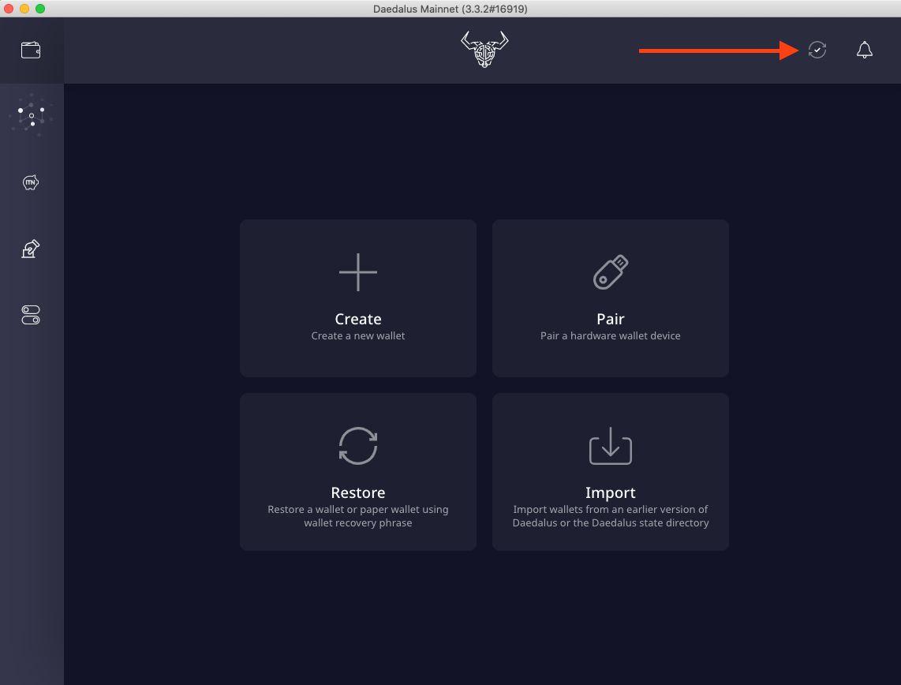
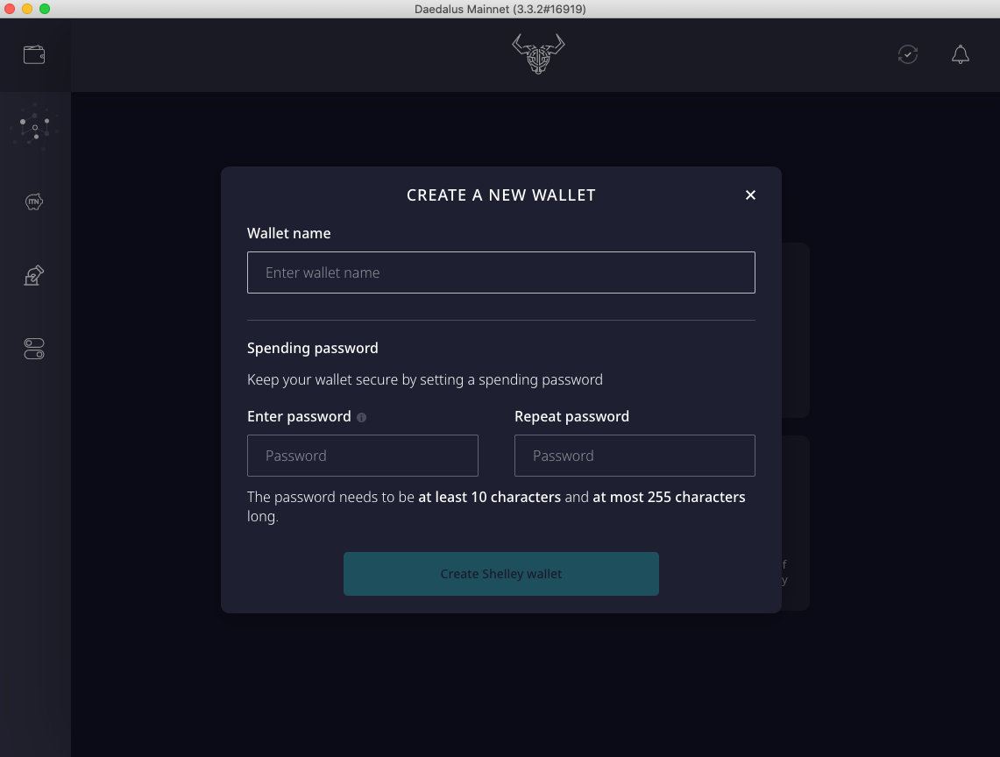
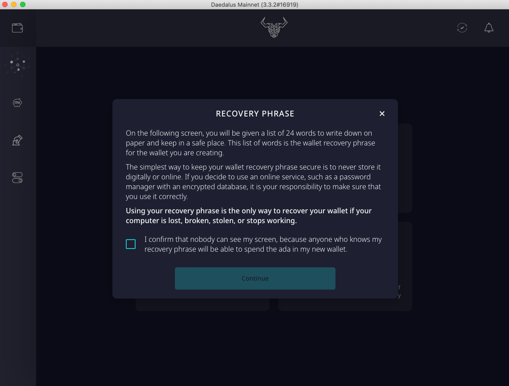
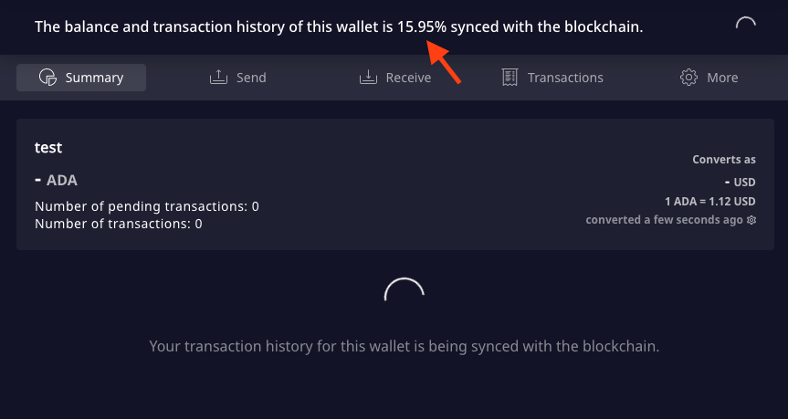

# Daedalus


At the time of this writing \(March 10th 2021\) a mobile version of Daedalus has **NOT** been released. Numerous **scams** have been reported, claiming Daedalus can be used on mobile. This is **NOT** the case and you should **NOT** trust these claims.  


## Let Daedalus sync to the blockchain

Once you have downloaded and verified Daedalus \(see previous section\) configure options as needed:

Accept the Terms and Conditions:


At this time it is **important** to let the software **sync to the blockchain**. This process will take time \(hours\). Wait until it has completed **before creating or restoring a wallet**.


To check synchronisation progress you can hover over **the circular arrows icon** in the top right corner:

Once Daedalus has **synced to the blockchain** a check mark will appear in the top right corner:

## Creating a wallet

Now it's time to create a new wallet! Choose a name for your wallet and a **strong** password \(you will need this to authorise **outgoing** transactions\): 


Your wallet name and password are only stored locally. If you were to loose access to your wallet, the **recovery phrase** \(see below\) is the only means to recover your wallet. If you need to do this, you will be prompted for a new name and password.  



From this point onward **follow the onscreen instructions to the letter**. Please make sure you understand what the **recovery phrase** is for, and how to best **keep it safe**.


Once you have noted and secured your **recovery phrase** you will be asked to enter it, as a means to confirm you have the correct sequence of 24 words. **Your wallet is now created** and ready to be funded, please wait for it to fully sync its transaction history:


Take your time to navigate Daedalus' interface and familiarise yourself with it. Below you will learn what to do in case you should loose access to your wallet. 


## Recovering a wallet

