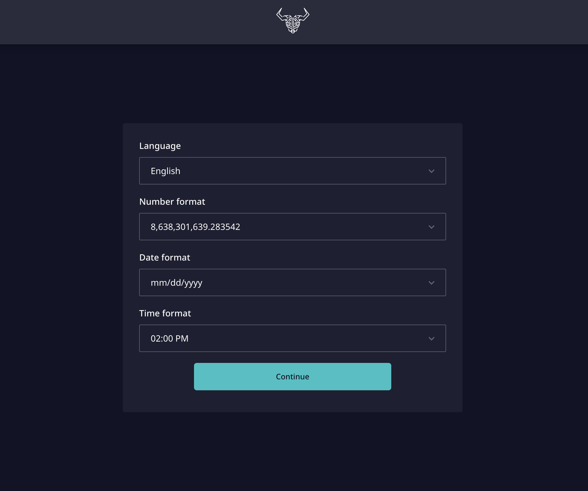
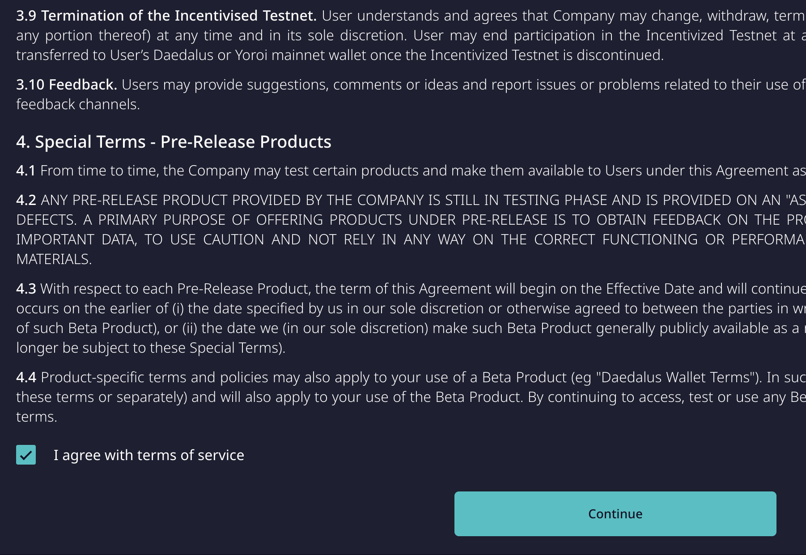
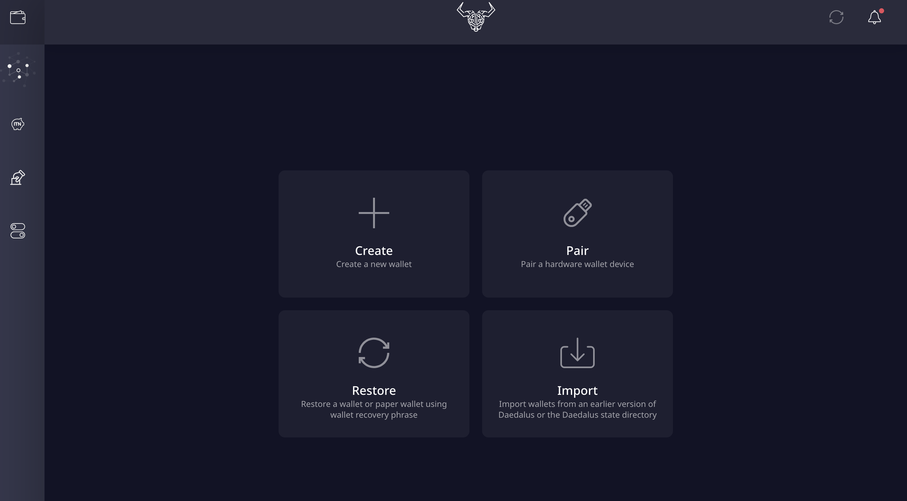

# Daedalus

## Let Daedalus sync to the blockchain

Once you have downloaded and verified Daedalus \(see previous section\) configure options as needed:

Accept the Terms and Conditions:


At this time it is **important** to let the software **sync to the blockchain**. This process will take time \(hours\). Wait until it has completed **before creating or restoring a wallet**.


To check synchronisation progress you can hover over **the circular arrows icon** in the top right corner:

## Creating a wallet

## Recovering a wallet

