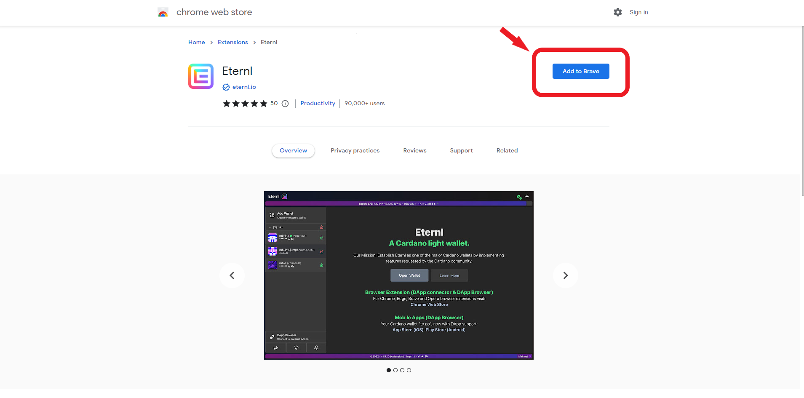
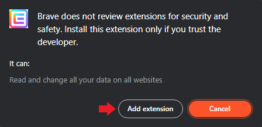

# Eternl

## About Eternl

[Eternl](https://eternl.io/) is a Cardano light wallet available as a website/progressive web app (PWA), Chrome browser extension, and mobile app on iOS and Android. Here are some of its key features:

* Ledger and Trezor hardware wallet support
* DApp browser to connect to the Cardano ecosystem
* Smart UTXO management and token fragmentation

## Add Eternl to your browser

Click [here](https://chrome.google.com/webstore/detail/eternl/kmhcihpebfmpgmihbkipmjlmmioameka) to open the Chrome Web Store and add it to your browser:

<figure><figcaption></figcaption></figure>

 

<figure><figcaption></figcaption></figure>


WIP: work in progress

