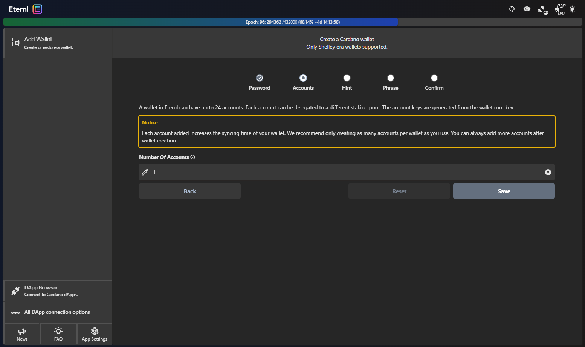

# Eternl

## About Eternl

[Eternl](https://eternl.io/) is a Cardano light wallet available as a website/progressive web app (PWA), Chrome browser extension, and mobile app on iOS and Android. Here are some of its key features:

* Ledger and Trezor hardware wallet support
* dApp browser to connect to the Cardano ecosystem
* Smart UTXO management and token fragmentation

## Add Eternl to your browser

Click [here](https://chrome.google.com/webstore/detail/eternl/kmhcihpebfmpgmihbkipmjlmmioameka) to open the Chrome Web Store and add it to your browser:

<figure><figcaption></figcaption></figure>

 

<figure><figcaption></figcaption></figure>

## Create your wallet in Eternl


Eternl allows users to browse and connect to Cardano dApps **using a wallet**. Below you'll create one :thumbsup:


Open the **Eternl** extension (top right corner of your browser). You will see the following in a new tab:

<figure><figcaption>
Acknowledge the version changes.
</figcaption></figure>

 

<figure><figcaption>
Check that you are on "Mainnet".
</figcaption></figure>

Click **Add Wallet**:

<figure><figcaption>
From here you can add Cardano wallets in many ways, we'll make a new one!
</figcaption></figure>

Click **Create Wallet**:

<figure><figcaption></figcaption></figure>

Choose a **name** to identify your wallet and a **strong password**:

<figure><figcaption></figcaption></figure>


**Please note:** Your wallet name and password are only stored locally. If you were to loose access to your wallet, the **recovery phrase** (see below) is the only means to recover your wallet. If you need to do this, you will be prompted for a new name and password.


We will only need one **Account** for the time being. Please click **Save**:

<figure><figcaption></figcaption></figure>


**Before you proceed**: From this point onward **follow the onscreen instructions to the letter**. Please make sure you understand what the **recovery phrase** is for, and how to best **keep it safe**.



**Tip:** Store your mnemonic on **paper** (a notebook that you will not loose): make 3 copies and keep them in at least 2 separate _physical_ locations.


**Acknowledge** that nobody can see your screen and click **continue:**

<figure><figcaption></figcaption></figure>

**Success:** You have written down and checked you 24-word **recovery phrase**. :partying\_face:

Your new Eternl wallet is now **ready to be funded**!

 Take your time to navigate Eternl's interface and familiarise yourself with it. Below you will learn what to do in case you should loose access to your wallet. 

## Recovering an Eternl wallet 

WIP: work in progress
