# Yoroi

## Configure Yoroi

Once you have installed Yoroi \(this example is based on the browser extension\), please configure it. First, **select your language** and click **continue**: 

Read and accept the **terms of use**, then click **continue**:

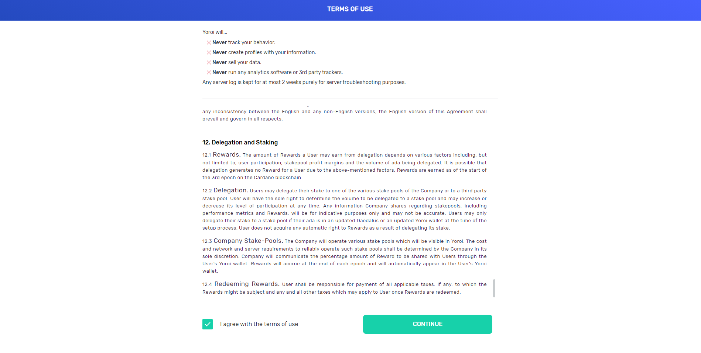

**Choose interface complexity**, we have chosen "Simple" for this example:

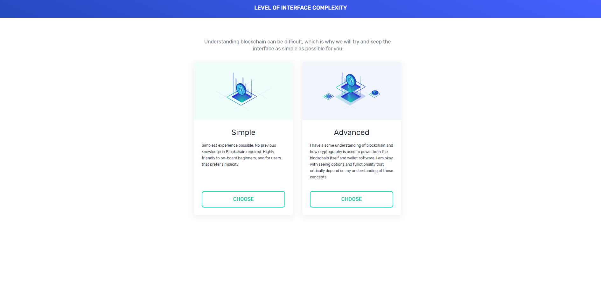

**Configure payment URLs** to your preference \(if you skip this step you can enable this option later\):

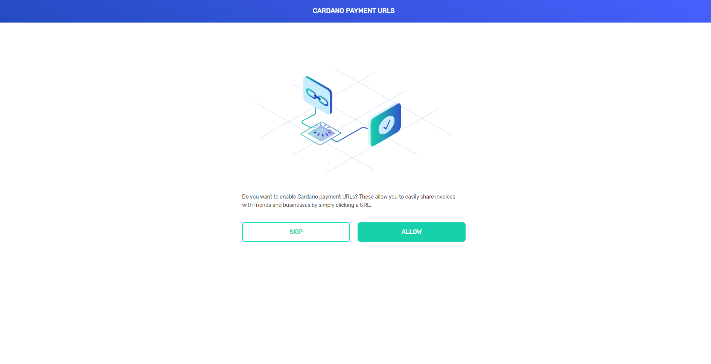

## Create your wallet in Yoroi

You are now ready to **create your ADA wallet** in Yoroi, please select "**Create wallet**":

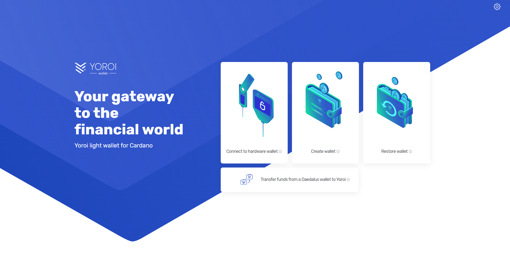

In the popup that follows, choose "**Cardano**":

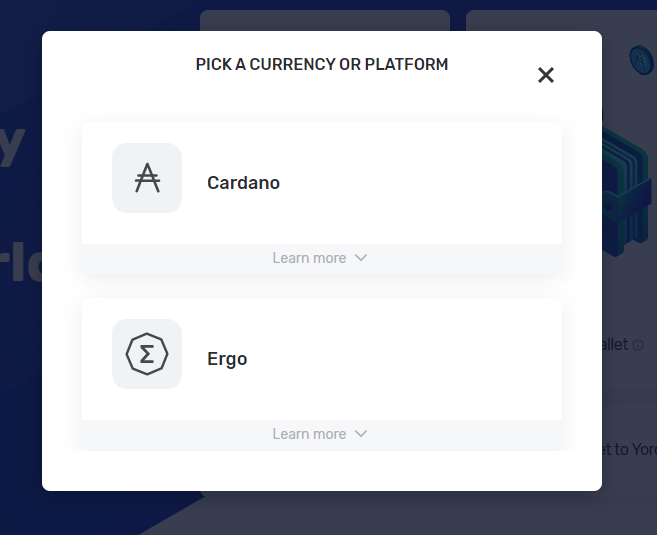

Then, "**Create wallet**":

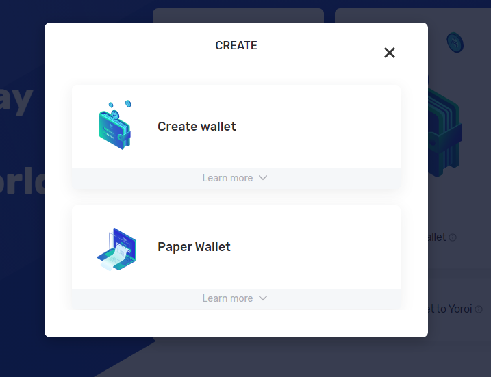

Configure your wallet with a **name and password**:


Your wallet name and password are only stored locally. If you loose access to your wallet, the **recovery phrase** \(see below\) is the only means to recover your wallet. If you need to do this, you will be prompted for a new name and password.  


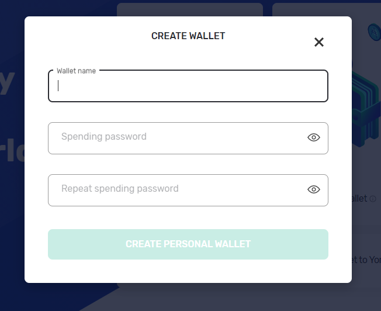

You will be asked to write down a **15-word recovery phrase**:


As discussed previously, please take all necessary precautions to **keep your recovery phrase safe**!


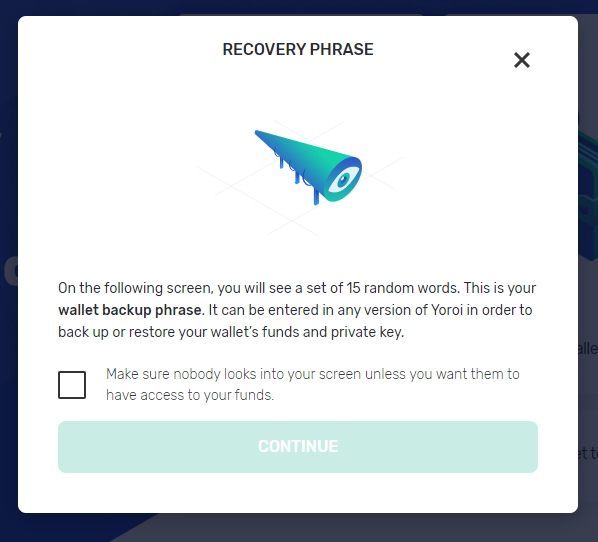

Write the words on **paper**, and make **multiple copies**! When prompted, **check** that you have written the correct phrase, **read** the instructions, and **confirm**:

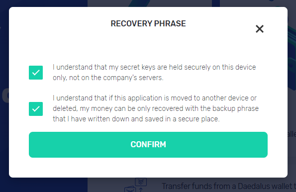

Your new **Yoroi wallet** is ready to be funded 😍 :

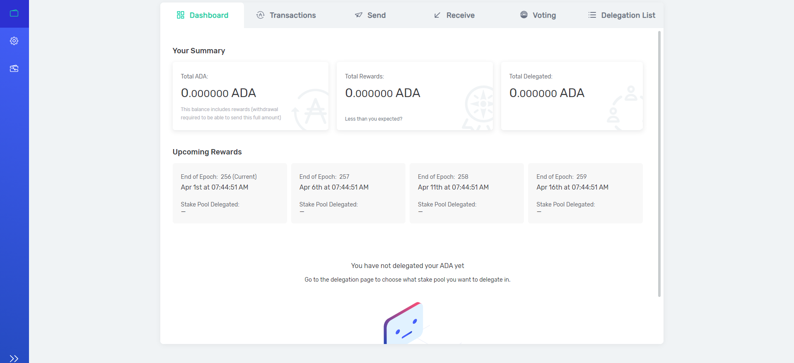


Take your time to navigate Yoroi's interface and familiarise yourself with it. Below you will learn what to do in case you should loose access to your wallet. 


## Recovering a Yoroi wallet

Should you loose access to your Yoroi software for whichever reason \(machine broken/lost/stolen\), please use your **recovery phrase** to restore it. Choose "**Restore wallet**" ****in the following menu:

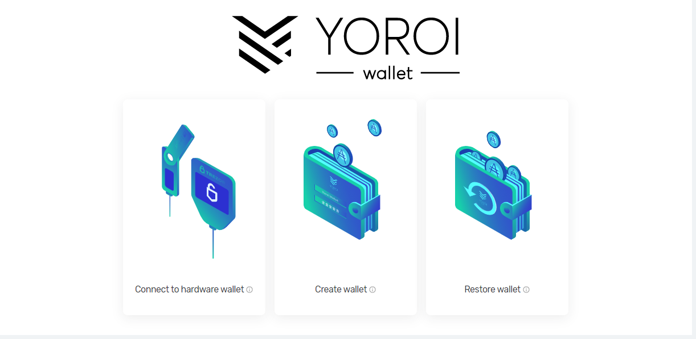

Then pick "**Cardano**":

If restoring a Yoroi wallet, please choose "**Enter a 15-word recovery phrase**":

And then, choose "**Shelley-era wallet**":

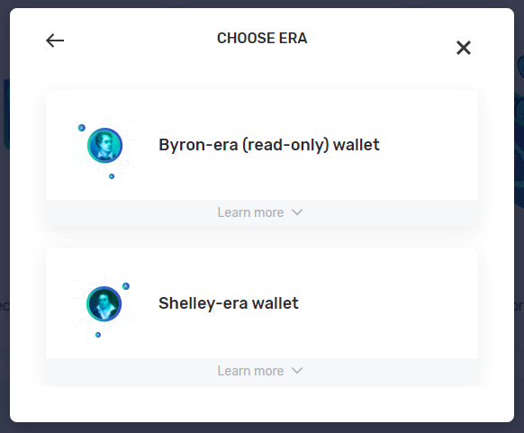


**Please note**: this method of recovery works for older Yoroi wallets as well, and for Daedalus wallets \(in the latter case you will have to choose 24-word recovery phrases\).


In the following dialogue, you must enter the **recovery phrase**: 

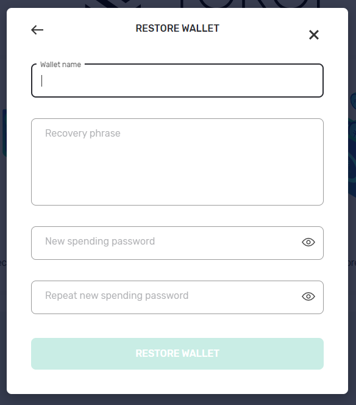

While entering your **recovery phrase**, you are prompted for a **new** wallet **name** and **password**. This was already noted above, and is important because:


Should someone get a hold of your **recovery phrase**, they can restore your wallet and **gain full control** of it, **even if they don't know your spending password** \(they will be asked, like you just then, to make a new password\).



Should you ever **loose** a copy of your **recovery phrase**, you must consider **your wallet compromised**, and transfer its contents to a new one.



You now have all the tools you need to **manage your Yoroi wallets**. Please use your judgement and take time to practice **creating**, **deleting** and **restoring** wallets, in order to gain confidence.


