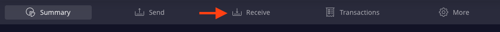
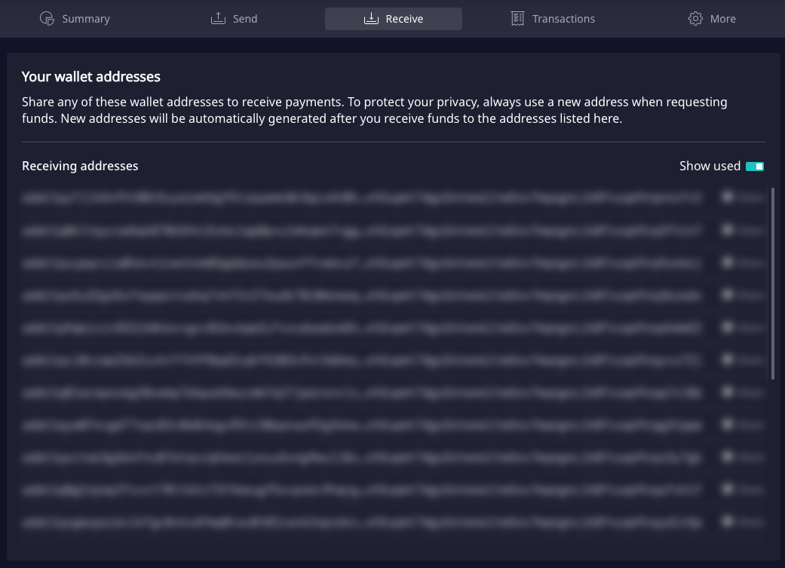
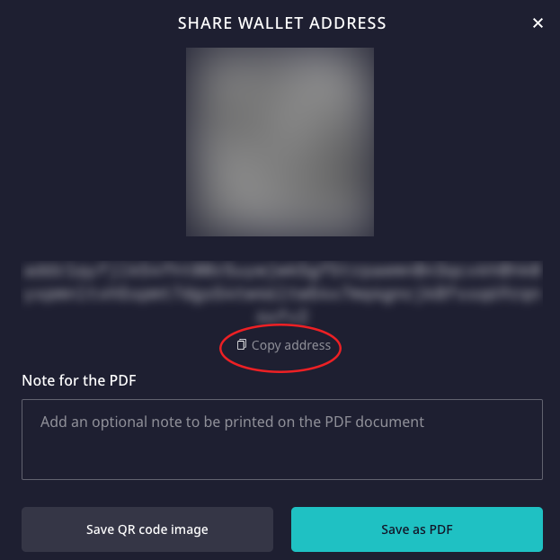
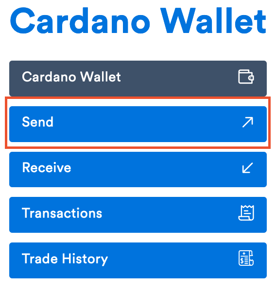

# 4. Sending ADA to your personal wallet

## Receiving funds in Daedalus

From your wallet top menu, navigate to **Receive**:


You will **not** need a **password to receive** funds, anyone can send you funds without your authorisation😎. The addresses below are blurred out intentionally, to prevent this, as the wallet in these pages is a test wallet only. 


Choose one of the available addresses:


Always choose a different address when receiving funds: this will protect your privacy. Funds will all go to the same wallet. 


In the popup choose "Copy address":

Now go back to your exchange wallet, in Coinspot once you open your ADA wallet, you will find the "Send" button:


In the dialogue that follows, paste the address you copied from Daedalus.



Please ensure that the amount you wish to send is present in your exchange wallet \(including transaction fees\).



Coinspot will ask for your 2FA and also send you a confirmation email prior to withdrawal of funds. 


Please check back in your Daedalus wallet: **your funds have been transferred** and can now be delegated to a stake pool 👏 

## Receiving funds in Yoroi

WIP

