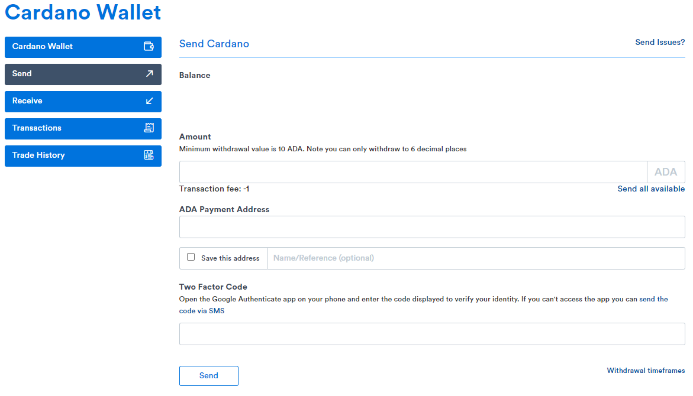
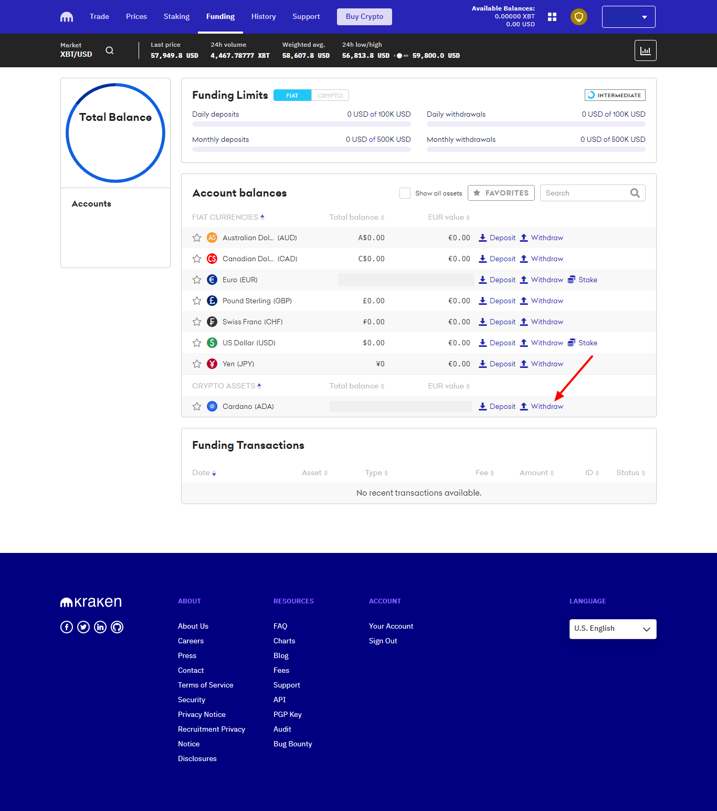
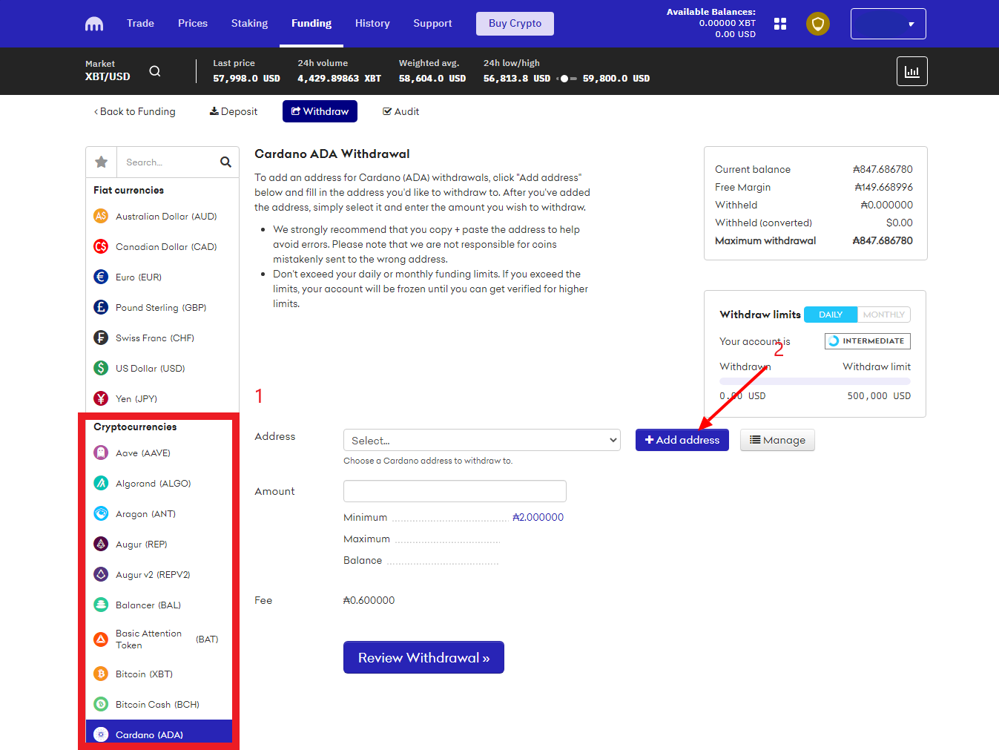
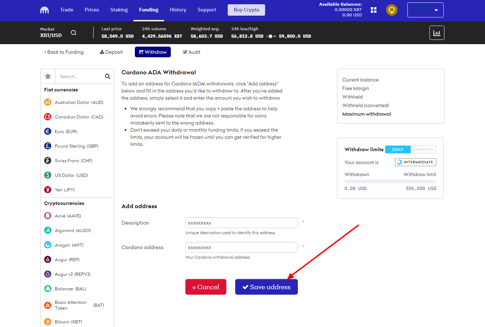
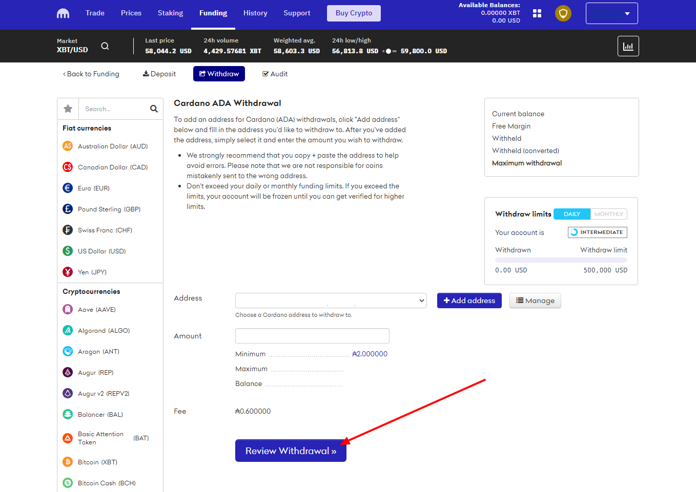
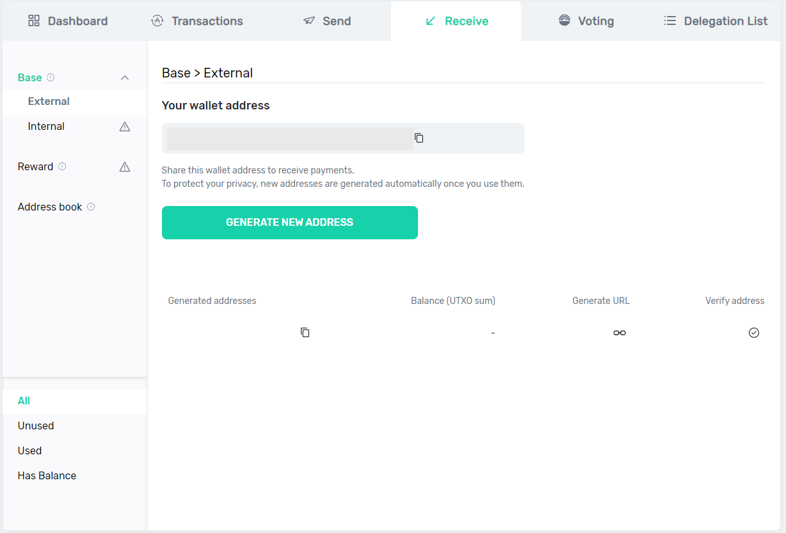

# 4. Sending ADA to your personal wallet

## Receiving funds in Daedalus

From your wallet top menu, navigate to **Receive**:


You will **not** need a **password to receive** funds, anyone can send you funds without your authorisation😎. The addresses below are blurred out intentionally, to prevent this, as the wallet in these pages is a test wallet only. 


Choose one of the available addresses:


Always choose a different address when receiving funds: this will protect your privacy. Funds will all go to the same wallet. 


In the popup choose "Copy address":

Now go **back to your exchange wallet.**

### **From Coinspot**

In Coinspot, once you open your ADA wallet, you will find the "**Send**" button:


In the dialogue that follows, **paste the address you copied** in the **"ADA Payment Address"** box.



Please ensure that the **amount you wish to send is present** in your exchange wallet \(including transaction fees\).



Coinspot will ask for your **2FA** \(which you should have, if you followed the guide [here](choosing-an-exchange/coinspot.md)\) and also send you a **confirmation email** prior to withdrawal of funds. 


### From Kraken

More information about withdrawing your ADA to a personal wallet is available here: [https://support.kraken.com/hc/en-us/articles/360000672763-How-to-withdraw-cryptocurrencies-from-your-Kraken-account](https://support.kraken.com/hc/en-us/articles/360000672763-How-to-withdraw-cryptocurrencies-from-your-Kraken-account)

From the **Funding** page, show all assets and find the "Withdraw" link for **Cardano**:

Ensure **Cardano \(ADA\)** is selected \(1\) and that you have the amount you'd like to transfer. Then, **add an address** to send your ADA to \(2\): 

Enter a description, paste the receiving address and save:

By clicking **Review Withdrawal** you can ensure the desired address is selected and that you are sending the correct amount:

## Receiving funds in Yoroi

In the "**Receive**" tab, **copy the address to your clipboard**:


You will **not** need a **password to receive** funds, anyone can send you funds without your authorisation😎. The addresses below are deleted intentionally, to prevent this, as the wallet in these pages is a test wallet only. 



Always choose a different address when receiving funds: this will protect your privacy. Funds will all go to the same wallet.


Now go **back to your exchange wallet** and paste the Yoroi wallet address in the relevant section. If you are using exchanges we have discussed here, please follow the steps outlined above.

## Confirm receipt of your funds

Please check back in your **Daedalus** or **Yoroi** wallet: **your funds have been transferred** and can now be delegated to a stake pool 👏 


Please note that, while rather quick, **the transfer of ADA from an exchange wallet to yours is not instant**. If you have doubts about your outgoing \(withdrawal\) transactions, please make sure to check with exchange support. 


